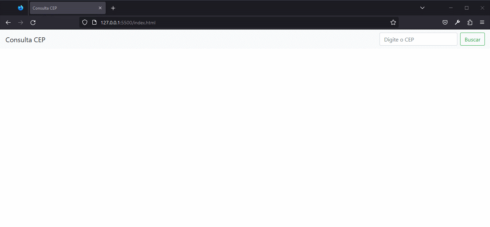

# curso-dio-introducao-a-biblioteca-jquery
Repositório com o material do curso Introdução à biblioteca jQuery da DIO.

Projeto que realiza a consulta por CEP na API ViaCEP e retorna o endereço.
## Demonstração

